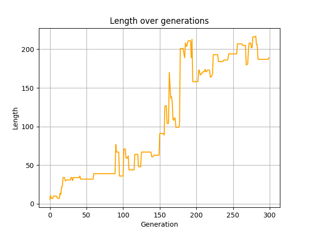
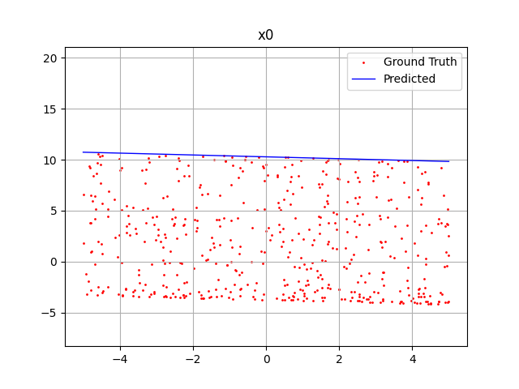
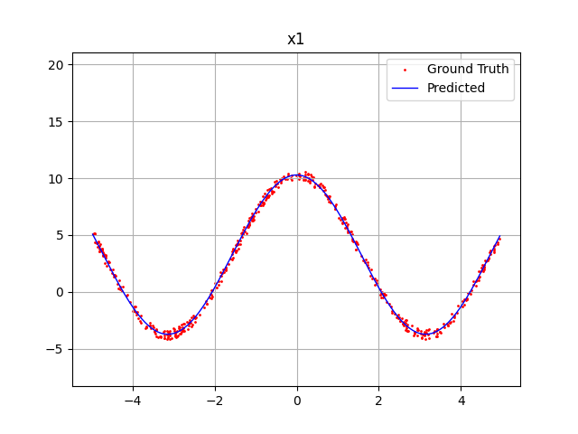
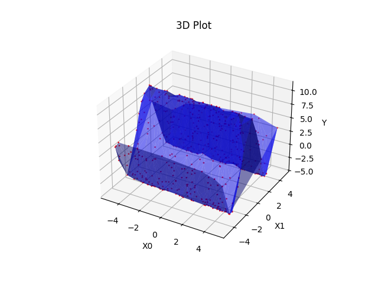

# Project Work: Symbolic Regression

## Introduction
The goal of this project is to perform symbolic regression using an evolutionary approach. Specifically, I implemented `swap subtree crossover` and a combination of `point mutation` and `subtree mutation` to evolve mathematical expressions that fit given datasets.

For each problem, I tuned a series of hyperparameters, which are summarized in the following table.

## Hyperparameter Tuning
### Table 1: Hyperparameters

| Problem | Population Size | Generations | Offspring Size | Individual Size | Tournament Size | Resize Factor | Mutation Const | Mutation Rate | Length Penalty | Crossover Rate |
|---------|-----------------|-------------|----------------|-----------------|-----------------|---------------|----------------|---------------|----------------|----------------|
| 0       | 100             | 200         | 30             | 6               | 5               | 500           | 0.25           | 0          | 5e-3              | 0.5            |
| 1       | 100             | 50          | 30             | 6               | 5               | 500           | 0.25           | 0             | 0              | 0.5            |
| 2       | 100             | 400         | 30             | 6               | 5               | 500           | 0.25            | 0.5          | 0              | 0.5            |
| 3       | 100             | 400         | 30             | 6               | 5               | 500           | 0.5            | 0             | 1e-2           | 0.5            |
| 4       | 100             | 300         | 30             | 6               | 5               | 500           | 0.25           | 0             | 1e-2              | 0.5            |
| 5       | 100             | 500         | 30             | 6               | 5               | 500           | 0.5            | 0             | 1e-2           | 0.5            |
| 6       | 100             | 400         | 30             | 6               | 5               | 500           | 0.25           | 0             | 1e-2              | 0.5            |
| 7       | 100             | 300         | 30             | 6               | 5               | 5000          | 0.4            | 0.2           | 1e-2           | 0.5            |
| 8       | 100             | 500         | 30             | 6               | 5               | 5000          | 0.5            | 0             | 1e-2           | 0.5            |

### Key Hyperparameters
- **Resize Factor**: Determines the number of samples taken from the original dataset. The hypothesis (which was confirmed) was that a large number of samples was unnecessary, so I downsampled by selecting every `n`th sample to speed up computation.
- **Length Penalty**: Penalizes longer solutions to control complexity. The computational bottleneck is the recursive function evaluation, which is linear in its size.
- **Mutation Constants and Rates**: These determine the probability of selecting one type of mutation over another, calculated as `MUT_A + MUT_B * (generation / GENERATIONS)`.

## Implementation Changes
I based my implementation on the `gxgp` library developed by Professor Squillero, making several optimizations and additions. Minor changes aimed to enhance performance, while major additions introduced new functionalities.

### Notable Additions
One of the significant additions is the implementation of enhanced mutation functions:

``` python
def mutate_point(tree: Node, num_variables, operators) -> Node:
    node_to_mutate = tree
    if node_to_mutate.type == NodeType.FUNCTION:
        while True:
            op = gxgp_random.choice(operators)
            if node_to_mutate.arity != arity(op):
                continue
            n= Node(op, node_to_mutate.successors)
            if n.short_name != node_to_mutate.short_name:
                break
        
    elif node_to_mutate.type == NodeType.CONSTANT:
        if gxgp_random.random() < 0.8:
            n= Node(gxgp_random.uniform(-2, 2))
        else:
            j = gxgp_random.randint(0, num_variables - 1) if num_variables > 1 else 0
            n = Node(f'x{j}')
    elif node_to_mutate.type == NodeType.VARIABLE:
        if gxgp_random.random() < 0.8 and num_variables > 1:
            i = int(node_to_mutate.short_name[1:])
            while True:
                j = gxgp_random.randint(0, num_variables - 1)
                if j != i:
                    break
            n = Node(f'x{j}')
        else:
            n = Node(gxgp_random.uniform(-2, 2))

    else:
        assert False, f'Unknown node type: {type(node_to_mutate)}'

    tree = n

    return tree


def mutate_random_points(tree: Node, num_variables: int, operators, probability: float = 0.5) -> Node:
    mask = np.random.choice([True, False], len(tree), p=[probability, 1-probability])
    while not np.any(mask):
        mask = np.random.choice([True, False], len(tree), p=[probability, 1-probability])

    
    def traverse_and_mutate(node, mask, idx=0):
        if idx >= len(mask):
            return node, idx

        if mask[idx]:
            node = mutate_point(node, num_variables, operators)

        
        succ = node.successors
        for i in range(len(node.successors)):
            succ[i], idx = traverse_and_mutate(node.successors[i], mask, idx + 1)

        node.successors = succ
        
        return node, idx
    
    mutant = deepcopy(tree)

    mutated_tree, _ = traverse_and_mutate(mutant, mask)
    return mutated_tree

def mutate_subtree(tree: Node, num_variables: int, operators, idx=None) -> Node:
    mutant = deepcopy(tree)
    
    if idx is None:
        idx = gxgp_random.randint(0, len(mutant) - 1)

    def traverse_and_mutate(node, idx, current_idx=0):
        if current_idx == idx:
            if node.is_leaf:
                op = gxgp_random.choice(operators)
                successors = []
                for _ in range(arity(op)):
                    if gxgp_random.random() < 0.5:
                        successors.append(Node(gxgp_random.uniform(-2, 2)))
                    else:
                        j = gxgp_random.randint(0, num_variables - 1)
                        successors.append(Node(f'x{j}'))
                return Node(op, successors), current_idx + 1
            else:
                op = gxgp_random.choice([operator.add, operator.sub, operator.mul])
                successors = []
                if gxgp_random.random() < 0.5:
                        successors.append(Node(gxgp_random.uniform(-2, 2)))
                else:
                    j = gxgp_random.randint(0, num_variables - 1)
                    successors.append(Node(f'x{j}'))
                successors.append(node)
                return Node(op, successors), current_idx + 1
        
        succ = node.successors
        for i in range(len(node.successors)):
            succ[i], current_idx = traverse_and_mutate(node.successors[i], idx, current_idx + 1)

        node.successors = succ

        return node, current_idx
    
    mutated_tree, _ = traverse_and_mutate(mutant, idx)
    return mutated_tree
```

More details and explanations are provided in the notebook.

## Results
### Table 2: Formula, MSE, and Length

| Problem | Formula | MSE | Length |
|---------|---------|-----|--------|
| 0       |  |  |  |
| 1       |  |  |  |
| 2       |  |  |  |
| 3       |  |  |  |
| 4       |  |  |  |
| 5       |  |  |  |
| 6       |  |  |  |
| 7       |  |  |  |
| 8       |  |  |  |

### Table 3: Plots
Each plot was generated by setting all variables to zero except for the one being plotted.

| Problem | Plots per component | 3D Plot |
|---------|---------------------|---------|
| 0       | <br> |  |
| 1       |  |  |
| 2       | <br><br> |  |
| 3       | <br><br> |  |
| 4       | <br> |  |
| 5       | <br> |  |
| 6       | <br> |  |
| 7       | <br> |  |
| 8       | <br><br><br><br><br> |  |

## Conclusion
This project successfully implemented symbolic regression using evolutionary strategies. The performance optimizations and added functionalities contributed to faster execution and improved model interpretability. Future work could explore alternative crossover methods and more sophisticated regularization techniques to further refine symbolic regression solutions.


### Table 4: Results

| Problem | Formula | MSE * 100 |
|---------|---------|-----|
| 0       | `np.add(np.multiply(0.279087, np.subtract(np.sin(x[1]), np.multiply(1.02334, np.multiply(0.994575, np.multiply(np.sin(x[1]), 0.279087))))), x[0])`       | `9.44131e-07`   |
| 1       | `np.sin(x[0])`       | `7.12594e-32`   |
| 2       | `np.add(np.multiply(np.add(np.multiply(np.multiply(x[0], np.sin(-0.898513)), 0.0545983), np.add(x[0], np.add(1.28009, np.sinh(np.multiply(np.exp(1.68327), np.add(0.987022, np.multiply(-1.69614, np.tanh(-1.56689)))))))), x[2]), np.multiply(np.add(x[1], np.add(np.add(0.987022, np.multiply(-1.69614, np.tanh(x[0]))), np.subtract(np.sinh(np.multiply(np.exp(1.68327), 1.7515)), np.add(np.multiply(1.70039, np.add(0.36735, np.cosh(np.add(x[2], x[0])))), np.cosh(np.add(np.multiply(0.328658, x[0]), np.add(x[2], x[1]))))))), np.add(np.multiply(np.exp(x[1]), 1.7515), np.add(x[0], np.add(np.exp(x[1]), np.multiply(x[0], np.exp(np.exp(1.68327))))))))`       | `1.44782e+15`   |
| 3       | `np.subtract(np.add(np.subtract(np.cos(np.cos(-1.51045)), x[2]), np.add(np.subtract(1.91265, x[2]), np.add(0.152973, np.add(np.subtract(np.multiply(0.490854, np.subtract(1.91265, x[2])), x[2]), np.multiply(x[0], np.add(x[0], x[0])))))), np.multiply(x[1], np.multiply(x[1], x[1])))`       | `0.0686768`   |
| 4       | `np.add(np.subtract(np.add(np.cos(x[1]), np.add(np.subtract(np.add(np.cos(x[1]), np.add(np.add(np.subtract(np.cos(x[1]), -1.35872), np.add(0.303101, np.cos(x[1]))), np.cos(x[1]))), -1.35872), np.cos(x[1]))), np.add(-0.653625, np.add(-0.124217, np.add(0.613686, np.multiply(0.0850385, np.add(x[0], np.add(np.multiply(0.628093, np.multiply(0.0850385, np.add(np.add(np.multiply(1.24288, np.multiply(0.0850385, np.add(np.add(-0.610512, x[0]), np.add(np.multiply(0.628093, np.multiply(0.0850385, np.add(np.add(np.subtract(-1.35872, np.subtract(np.add(np.subtract(np.add(np.add(1.41544, np.cos(np.add(np.add(-0.302075, x[1]), np.cos(-1.35872)))), np.cos(1.06531)), x[0]), np.cos(np.subtract(np.cos(np.subtract(np.cos(-0.799769), -1.40051)), np.cos(x[1])))), x[0])), -1.08891), np.add(-0.865316, np.multiply(0.0850385, np.add(np.add(-0.231722, np.subtract(np.subtract(np.add(np.subtract(np.add(np.add(1.41544, np.add(np.cos(x[1]), np.cos(1.06531))), np.cos(np.cos(x[1]))), x[0]), np.cos(0.628093)), x[0]), np.subtract(np.add(x[1], np.cos(1.06531)), np.add(np.add(np.add(np.subtract(np.cos(x[1]), -1.35872), np.add(0.303101, np.cos(x[1]))), np.cos(x[1])), np.multiply(-1.77574, np.add(0.613686, np.multiply(0.0850385, np.multiply(x[0], 1.83506)))))))), np.cos(x[1]))))))), -1.08891)))), x[0]), np.multiply(0.0850385, np.add(np.subtract(-1.35872, np.subtract(np.add(np.subtract(np.cos(np.subtract(-0.0126793, -0.649077)), x[0]), np.cos(np.multiply(0.628093, -1.08891))), x[0])), np.multiply(0.0850385, np.add(x[0], np.add(np.multiply(0.628093, np.multiply(0.0850385, np.add(np.add(np.multiply(x[0], np.cos(np.multiply(-0.541863, x[0]))), np.subtract(x[1], x[0])), np.add(0.303101, np.cos(x[1]))))), -1.08891)))))))), -1.08891))))))), np.cos(x[1]))`       | `1.12846e-08`   |
| 5       | `np.multiply(x[0], np.multiply(0.363602, np.multiply(np.add(np.subtract(x[0], 0.363602), np.cos(x[0])), np.multiply(np.cos(-1.50301), np.multiply(0.363602, np.multiply(np.multiply(np.multiply(np.multiply(np.subtract(x[1], 0.698396), np.multiply(np.cos(-1.50301), np.exp(-1.50301))), np.multiply(0.363602, np.multiply(np.add(x[0], np.subtract(x[1], 0.698396)), np.multiply(np.multiply(np.cos(-1.50301), np.multiply(np.subtract(x[1], np.subtract(np.cos(np.exp(np.subtract(-1.52497, x[1]))), -0.256538)), np.multiply(np.cos(-1.50301), np.exp(-1.50301)))), np.multiply(np.multiply(np.subtract(x[1], np.cos(np.add(x[0], x[1]))), np.multiply(np.cos(-1.50301), np.exp(-1.80762))), np.exp(-1.77607)))))), np.cos(-1.77607)), np.multiply(np.multiply(np.subtract(np.cos(np.cos(np.subtract(x[1], 0.698396))), np.cos(-1.77607)), np.exp(-1.50301)), np.exp(-1.50301))))))))`       | `1.13839e-17`   |
| 6       | `np.add(np.add(np.subtract(np.multiply(np.add(x[1], np.add(-0.209734, np.subtract(np.sin(0.236473), np.add(x[1], np.subtract(x[1], np.multiply(np.add(x[1], np.subtract(x[1], np.multiply(np.add(np.add(0.632786, x[1]), np.subtract(np.subtract(np.subtract(x[1], np.add(-0.664427, np.multiply(np.add(np.add(0.632786, np.add(x[1], 0.787757)), np.add(x[1], np.subtract(np.subtract(np.add(np.subtract(np.multiply(np.add(x[1], np.add(1.4366, np.subtract(np.multiply(x[0], np.sin(0.236473)), np.add(x[1], np.subtract(x[1], np.multiply(np.add(0.236473, np.subtract(x[1], np.subtract(x[0], np.multiply(np.add(x[1], np.multiply(-0.451366, np.add(np.add(0.632786, x[1]), np.sin(np.sin(np.subtract(np.multiply(np.multiply(np.subtract(x[0], x[0]), np.add(np.multiply(-1.93544, np.add(0.632786, np.cos(x[1]))), np.sin(np.sin(0.901804)))), np.sin(0.236473)), np.add(x[1], np.multiply(-0.97893, np.subtract(x[1], np.multiply(np.add(np.subtract(np.add(np.add(0.632786, np.cos(np.cos(1.69813))), np.sin(np.sin(0.901804))), -1.93056), np.subtract(x[1], np.subtract(np.cos(1.69813), np.add(x[0], np.multiply(x[0], np.sin(np.sin(0.787757))))))), np.cos(1.69813))))))))))), np.cos(np.cos(np.sin(np.add(0.114782, np.multiply(np.add(np.subtract(np.add(np.add(0.632786, np.cos(np.multiply(-0.479409, x[0]))), np.sin(np.sin(0.901804))), -1.93056), np.subtract(x[1], np.subtract(np.cos(1.69813), np.add(x[0], np.multiply(x[0], np.sin(np.sin(0.787757))))))), np.cos(1.69813)))))))))), np.cos(1.69813))))))), 0.236473), np.multiply(x[0], np.sin(np.sin(0.901804)))), x[1]), np.add(x[0], np.multiply(x[0], np.sin(np.sin(0.787757))))), x[0]))), np.cos(1.69813)))), np.add(x[0], np.multiply(x[0], np.sin(0.787757)))), x[0])), np.cos(1.69813)))), np.cos(1.69813))))))), 0.236473), np.multiply(x[0], np.sin(np.sin(0.901804)))), x[1]), x[1])`       | `9.48049e-10`   |
| 7       | `np.cosh(np.subtract(-0.169562, np.subtract(-0.381632, np.add(np.multiply(x[0], x[1]), np.exp(np.cos(np.multiply(np.add(np.multiply(x[0], x[1]), np.exp(np.cos(np.cosh(0.00138594)))), np.subtract(x[0], x[1]))))))))`       | `11613.6`   |
| 8       | `np.multiply(np.add(-1.73296, np.add(-0.991745, np.sinh(x[5]))), np.add(np.cosh(np.exp(1.68681)), np.exp(np.exp(1.48789))))`       | `7.38074e+07`   |